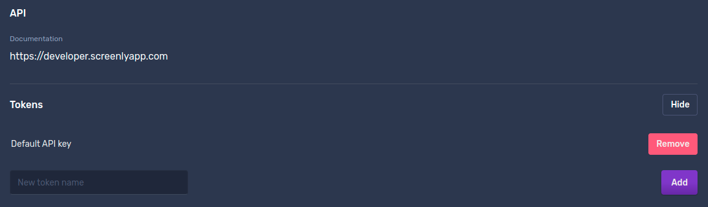

# Setup asset with JS injection on your screen

This tutorial will show how to create a web asset with JS injection using only [Screenly API](https://developer.screenlyapp.com/).

Any request to the API requires an API token. \
You can acquire it in Screenly [Web dashboard](https://your-domain.screenlyapp.com/manage/account/team) by adding a new token.



To make API requests tutorial uses Python 3 and Python [requests](https://pypi.org/project/requests/) library to make API calls.
You can use `curl` or something else alternatively.

Also, for this tutorial paired screen ID is required.
If you don't know your screen ID, you can get it through [API](https://developer.screenlyapp.com/#operation/screens_list):
```python
import os
import requests

TOKEN = os.getenv('TOKEN')

HEADERS = {
    "Authorization": f"Token {TOKEN}",
    "Content-Type": "application/json"
}

response = requests.get(
    'https://api.screenlyapp.com/api/v3/screens/',
    headers=HEADERS
)
print(response.json())
```
It will print all your screens.
Select the screen and get the `id` field. It will be similar to '01DQ0KJT300007KJAK074WGTBD'.


All code below assumes TOKEN and SCREEN_ID are passed as environment variables:
`TOKEN=<token> SCREEN_ID=<screen_id> python your_script.py`


## Headers
First, prepare headers for the API. Screenly uses [Header](https://developer.screenlyapp.com/#section/Authentication/Bearer) token authorization.

```python
import os
TOKEN = os.getenv('TOKEN')

HEADERS = {
    "Authorization": f"Token {TOKEN}",
    "Content-Type": "application/json"
}
```

## Create Group

[API](https://developer.screenlyapp.com/#operation/groups_create)

Now we need to create a group. 
Group is used to apply playlists with content to screens.
Screen ID is passed as a payload to associate this new group and the screen.

```python
SCREEN_ID = os.getenv('SCREEN_ID')

def create_group(screen_id, name):
    response = requests.post(
        url='https://api.screenlyapp.com/api/v3/groups/',
        json={
            'name': name,
            'screens': [{
                'id': screen_id
            }]
        },
        headers=HEADERS
    )
    group_id = response.json()['id']
    print(f"Group created: {group_id}")
    return group_id

# For an asset to be associated with the screen we need to label the playlist and screen with the same group.
group_id = create_group(SCREEN_ID, "My Js injection Group")
```

## Create Web Asset

[API](https://developer.screenlyapp.com/#operation/assets_create)

Here, we are creating a web asset with JS injection.
JS injection is a JavaScript code, that will run once a page is loaded on your screen.

Here are some examples and tips on writing a proper JS Injector code: [Js Injector](../javascript-injectors/README.md)

```python
import requests


# This js injection will be applied when page is shown on the device.
JS_CODE = """
document.getElementsByClassName('markdown-body')[0].textContent = 'Hello There!';
"""
SOURCE_URL = 'https://playground.srly.io/api/'

def create_asset(url, js_code, title):
    response = requests.post(
        'https://api.screenlyapp.com/api/v3/assets/',
        json={
            'title': title,
            'js_injection': js_code,
            'source_url': url
        },
        headers=HEADERS
    )
    asset_id = response.json()['id']
    print(f"Asset created: {asset_id}")
    return asset_id

# Create a new web asset and attach js_injection.
# It uses SOURCE_URL above - the web page hosted by GitHub pages.
# You can use your page if needed.
create_asset(SOURCE_URL, JS_CODE, 'My new Asset')
```
This code will create a web asset with a JS-injected code.
Though the asset is not available right away. It must be processed, before it is used.
You can check asset status in the `status` field.

[API](https://developer.screenlyapp.com/#operation/assets_read)

For simple assets like this, it usually takes several seconds to process, but it could take more time, for instance for a huge video file.

Let's write a simple wait loop to wait until the asset is processed.

```python
from time import sleep


def get_asset_status(asset_id):
    response = requests.get(
        f'https://api.screenlyapp.com/api/v3/assets/{asset_id}/',
        headers=HEADERS
    )
    return response.json()['status']

def wait_asset_processed(asset_id):
    for i in range(1, 4):
        sleep(i ** 2)
        status = get_asset_status(asset_id)
        if status == 'finished':
            break
        if status == 'error':
            raise

    print(f"Asset is processed: {asset_id}")

wait_asset_processed(asset_id)
```

## Create Playlist

[API](https://developer.screenlyapp.com/#operation/playlists_create)

```python
def create_playlist(group_id, asset_id, title):
    response = requests.post(
        url='https://api.screenlyapp.com/api/v3/playlists/',
        json={
            'title': title,
            'groups': [{'id': group_id}],
            'assets': [{'id': asset_id, 'duration': 4}],
        },
        headers=HEADERS
    )
    playlist_id = response.json()['id']
    print(f"Playlist created: {playlist_id}")
    return playlist_id

create_playlist(group_id, asset_id, "My Js Injection Playlist")
```

Now we have a playlist with a web asset as content.
Playlist is targeted to a group, created above,
and, after a bit, you should see 'New Text' on your screen. 'New Text' is text replaced with JS code.

Full [code example](./web_asset_js_injection.py).
