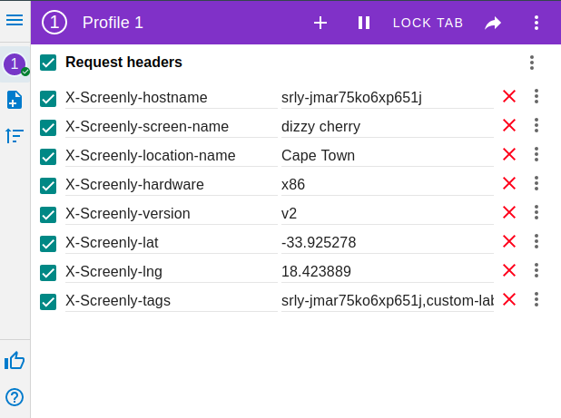

## Web Asset Metadata
 
Metadata is a special property on Web asset,
that will enable extra headers sent from the device to the 
target page of web asset.

These extra headers mainly include screen related information.. 

You can see the full list of headers sent below. 
Header values are examples.

```json
{
    "X-Screenly-hostname": "srly-jmar75ko6xp651j",
    "X-Screenly-screen-name": "dizzy cherry",
    "X-Screenly-location-name": "Cape Town",
    "X-Screenly-hardware": "x86",
    "X-Screenly-version": "v2",
    "X-Screenly-lat": "-33.925278",
    "X-Screenly-lng": "18.423889",
    "X-Screenly-tags": "srly-jmar75ko6xp651j,custom-label"
}
```

To enable sending metadata - click 'Advanced' on any web asset edit page
and check Send Metadata.


### Docker

To try this feature you can use simple flask based docker container.

Build it with \
`cd asset-metadata` \
`docker build -t screenly/asset-metadata-example:latest .`

```
docker run -d \
    --name=screenly-asset-metadata-example \
    -p "5000:5000" \
    screenly/asset-metadata-example:latest
```

[Open in browser](0.0.0.0:5000)


For testing you could use browser extensions like [ModHeader](https://chrome.google.com/webstore/detail/modheader/idgpnmonknjnojddfkpgkljpfnnfcklj?hl=en) to inject Request headers.


