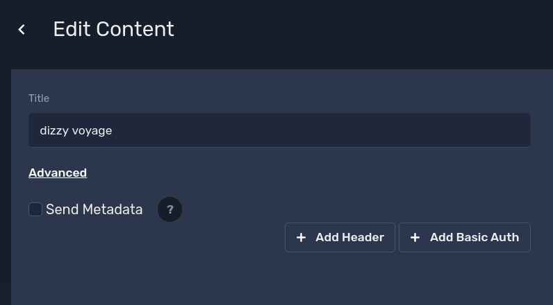

### Web Asset Metadata
 
Metadata is a special property on Web asset,
that will enable extra headers sent from the device to the 
target page of web asset.

These extra headers mainly include screen related information,
like hostname, screen name, location, etc.

Example headers

```json
{
    "X-Screenly-hostname": "srly-jmar75ko6xp651j",
    "X-Screenly-screen-name": "dizzy cherry",
    "X-Screenly-location-name": "Cape Town",
    "X-Screenly-hardware": "x86",
    "X-Screenly-version": "v2",
    "X-Screenly-lat": "-33.925278",
    "X-Screenly-lng": "18.423889",
    "X-Screenly-tags": "srly-jmar75ko6xp651j,custom-label"
}
```

To enable on asset click 'Advanced' on any web asset
and check Send Metadata.




To try this feature you can use simple python web server to view headers sent

[python example](./show_metadata_simple_server.py)

Run it with 
`python3 show_metadata_simple_server.py` 

and open it locally or from device.


For testing you could use browser extensions like [ModHeader](https://chrome.google.com/webstore/detail/modheader/idgpnmonknjnojddfkpgkljpfnnfcklj?hl=en) to inject Request headers.

