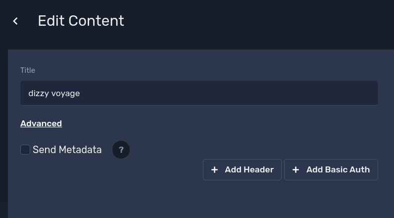
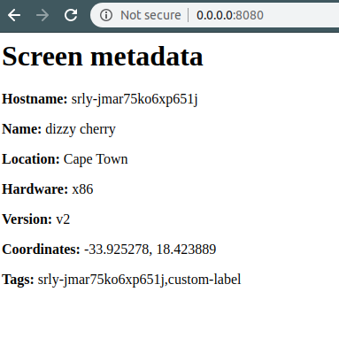

# Web Asset Metadata

Metadata is a special property on a web asset that will enable sending extra headers from the device to the target page of the web asset.

These extra headers mainly include screen-related information.

Here's a list of sample headers:

```json
{
    "X-Screenly-hostname": "srly-jmar75ko6xp651j",
    "X-Screenly-screen-name": "dizzy cherry",
    "X-Screenly-location-name": "Cape Town",
    "X-Screenly-hardware": "x86",
    "X-Screenly-version": "v2",
    "X-Screenly-lat": "-33.925278",
    "X-Screenly-lng": "18.423889",
    "X-Screenly-tags": "srly-jmar75ko6xp651j,custom-label"
}
```

To enable sending metadata - click 'Advanced' on any web asset edit page and check 'Send Metadata'.



## Live Demo

You can find a live demo of this on [asset-metadata-example.srly.io](https://asset-metadata-example.srly.io/).

## Docker

To try this feature, you can use a simple [Flask](https://flask.palletsprojects.com/) based Docker container.

To build the container, run:

```bash
$ cd asset-metadata
$ docker build \
    -t screenly/asset-metadata-example .
```

You can then run it using:

```bash
$ docker run -d \
    --name=screenly-asset-metadata-example \
    -p "8080:8080" \
    screenly/asset-metadata-example
```

[Open in browser](http://0.0.0.0:8080)





For testing, you could use browser extensions like [ModHeader](https://chrome.google.com/webstore/detail/modheader/idgpnmonknjnojddfkpgkljpfnnfcklj?hl=en) to inject Request headers.


