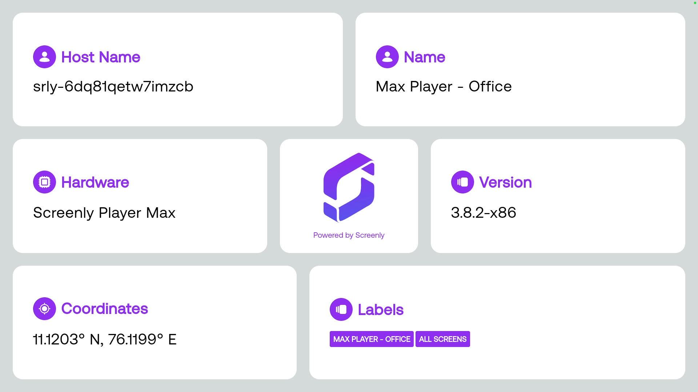

# Screenly Asset Metadata



This Edge App displays the screen metadata - Hostname, Screen Name, Position , Hardware name, Firmware version, Labels, etc.

## Prerequisites

- [Bun (1.2.2+)](https://bun.sh/docs/installation)
- [Screenly Edge App CLI (v1.0.3+)](https://github.com/Screenly/cli?tab=readme-ov-file#installation)

## Getting Started

```bash
bun install
screenly edge-app create \
    --name=EDGE_APP_NAME \
    --in-place
```

## Create an Edge App Instance via CLI

```bash
screenly edge-app instance create --name=EDGE_APP_INSTANCE_NAME
```

## Deployment

```bash
bun run build
bun run deploy
```

## Development

Run the following on a terminal to start the development server:

```bash
bun install
bun run dev
```

Running the development server will generate a `mock-data.yml` file in the root of the project. This file is used to store the mock data for the screenly.js file.

You can edit the `mock-data.yml` file to change the mock data for the screenly.js file. Refreshing the browser will reload the app with the new mock data.

If you change `screenly.yml` to add, update or remove a setting, the `mock-data.yml` file should be removed so that the development server will generate a new one with the new settings.

```bash
bun run clear-mock-data && bun run dev
```

## Unit Tests

To run unit tests:

```bash
bun run test:unit
```

Press `q` to quit the test runner.

## E2E Tests

Install dependencies for the first run:

```bash
bun run playwright install-deps
bun run playwright install
```

To run E2E tests:

```bash
bun run test:e2e
```

### Linting and Formatting

```bash
bun run lint
bun run format
```
