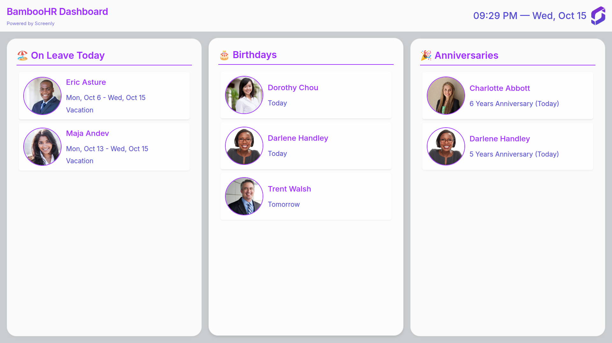

# BambooHR App

A digital signage dashboard that displays employee information from Bamboo HR, including birthdays, work anniversaries, and current leave status. Perfect for office displays and team spaces.



## Features

- Real-time employee information display
- Birthday and work anniversary celebrations
- Current leave status tracking
- Automatic timezone and locale detection
- Automatic brand colors and logo from Screenly brand page
- Responsive design for any screen size

## Prerequisites

- Bun (1.2.2+)
- Bamboo HR API credentials
- Screenly CLI installed (see [installation guide](https://github.com/Screenly/cli))

## Installation

1. **Log in to Screenly CLI**

```bash
screenly login
```

2. **Create the Edge App**

```bash
cd edge-apps/bamboo-hr-app
screenly edge-app create \
    --name bamboo-hr-app \
    --in-place
```

3. **Deploy the App**

```bash
bun install && bun run deploy
```

4. **Create an Instance**

```bash
screenly edge-app instance create
```

## Configuration

### API Credentials

Set your BambooHR subdomain:

```bash
screenly edge-app setting set subdomain=YOUR_SUBDOMAIN
```

Set your BambooHR API credentials:

```bash
screenly edge-app setting set api_key=YOUR_API_KEY
```

### Timezone and Locale

Override the default timezone and locale if needed:

```bash
screenly edge-app setting set override_timezone='Europe/London'
screenly edge-app setting set override_locale='en'
```

## Deployment

```bash
bun run deploy
```

> [!NOTE]
> The `deploy` command takes care of building the app as well.

## Development

Install the dependencies for the first run:

```bash
bun install
```

Run the development environment with a single command:

```bash
bun run dev
```

This will build in watch mode and start the development server via [Screenly CLI](https://github.com/Screenly/cli).

## Known Issues

This app does not work on Screenly Anywhere screens at the moment. It currently supports only physical players (Screenly Player and Screenly Player Max).

## Support

For issues or questions, please contact Screenly support or open an issue in the repository.
