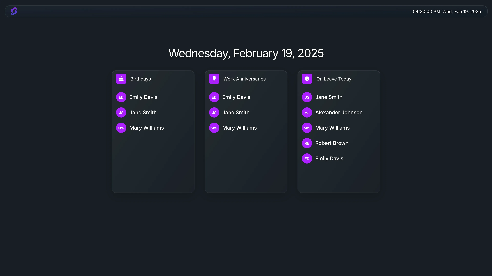

# BambooHR App

Displays employee birthdays, work anniversaries, and who's on leave today, sourced from BambooHR.



## Prerequisites

- [Bun](https://bun.sh/) 1.2.2+
- [Screenly CLI](https://developer.screenly.io/edge-apps/#getting-started)
- A BambooHR account with API access

## Getting Started

```bash
bun install
```

## Development

```bash
bun run dev
```

This starts the Vite dev server alongside a local CORS proxy on `http://127.0.0.1:8080`.

## Building

```bash
bun run build
```

## Type Checking

```bash
bun run type-check
```

## Linting & Formatting

```bash
bun run lint
bun run format
```

## Testing

```bash
bun test
```

## Screenshots

```bash
bun run screenshots
```

## Deployment

```bash
screenly edge-app create --name bamboo-hr-app --in-place
bun run deploy
screenly edge-app instance create
```

## Configuration

| Setting             | Type   | Required | Description                                                                |
| ------------------- | ------ | -------- | -------------------------------------------------------------------------- |
| `api_key`           | secret | Yes      | BambooHR API key                                                           |
| `subdomain`         | string | Yes      | BambooHR subdomain (e.g. `example` from `example.bamboohr.com`)            |
| `display_errors`    | string | No       | Display errors on screen for debugging (`true`/`false`). Default: `false`. |
| `override_locale`   | string | No       | Override locale (e.g. `en`, `fr`, `de`). Defaults to system locale.        |
| `override_timezone` | string | No       | Override timezone (e.g. `Europe/London`). Defaults to GPS-based detection. |
| `enable_analytics`  | string | No       | Enable analytics (`true`/`false`). Default: `true`.                        |
| `tag_manager_id`    | string | No       | Google Tag Manager ID.                                                     |
| `sentry_dsn`        | secret | No       | Sentry DSN for error tracking.                                             |

> **Note:** This app only works on physical Screenly players (not Screenly Anywhere) due to CORS proxy requirements.
