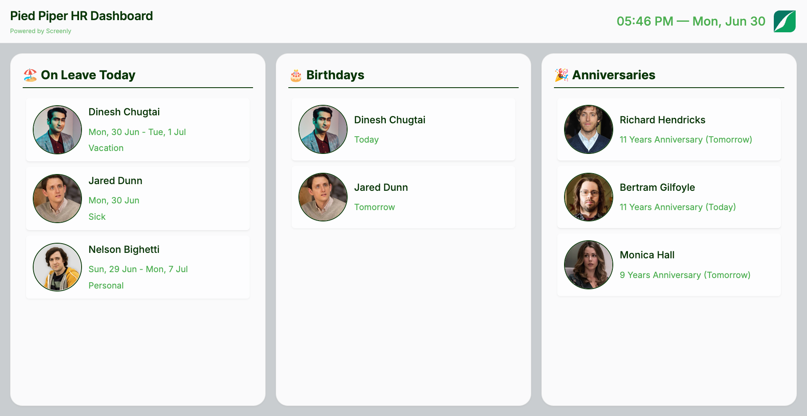

# Charlie HR App

A digital signage dashboard that displays employee information from Charlie HR, including birthdays, work anniversaries, and current leave status. Perfect for office displays and team spaces.



## Features

- Real-time employee information display
- Birthday and work anniversary celebrations
- Current leave status tracking
- Automatic timezone and locale detection
- Automatic brand colors and logo from Screenly brand page
- Responsive design for any screen size

## Prerequisites

- Charlie HR API credentials (client_id and client_secret)
- Screenly CLI installed (see [installation guide](https://github.com/Screenly/cli))

## Installation

1. **Log in to Screenly CLI**

```bash
screenly login
```

2. **Create the Edge App**

```bash
cd edge-apps/charlie-hr-app
screenly edge-app create \
    --name charlie-hr-app \
    --in-place
```

3. **Deploy the App**

```bash
screenly edge-app deploy
```

4. **Create an Instance**

```bash
screenly edge-app instance create
```

## Configuration

### API Credentials

Set your Charlie HR API credentials:

```bash
screenly edge-app setting set client_id=YOUR_CLIENT_ID
screenly edge-app setting set client_secret=YOUR_CLIENT_SECRET
```

### Timezone and Locale

Override the default timezone and locale if needed:

```bash
screenly edge-app setting set override_timezone='Europe/London'
screenly edge-app setting set override_locale='en'
```

## Support

For issues or questions, please contact Screenly support or open an issue in the repository.
