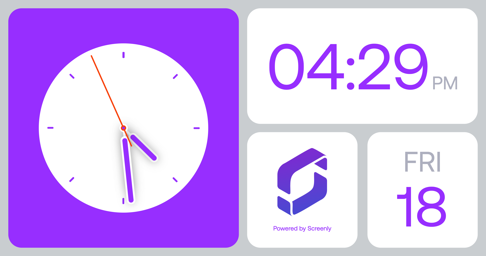

# Screenly Clock App



## Prerequisites

- [Bun (1.2.2+)](https://bun.sh/docs/installation)
- [Screenly Edge App CLI (v1.0.3+)](https://github.com/Screenly/cli?tab=readme-ov-file#installation)

## Getting Started

```bash
bun install
screenly edge-app create \
    --name=EDGE_APP_NAME \
    --in-place
```

## Create an Edge App Instance via CLI

```bash
screenly edge-app instance create --name=EDGE_APP_INSTANCE_NAME
```

## Deployment

```bash
bun run deploy
```

> [!NOTE]
> The `deploy` command takes care of building the app as well.

## Development

Install the dependencies for the first run:

```bash
bun install
```

Run the following on a terminal to start the build process in watch mode:

```bash
bun run build:dev
```

Open another terminal and run the following:

```bash
bun run dev
```

This will start the development server via the [Screenly CLI](https://github.com/Screenly/cli).

```plaintext
$ screenly edge-app run --path=dist/
Edge App emulator is running at http://127.0.0.1:38085/edge/1/index.html
```

Copy the URL and paste it in the browser to see the app in action.

## Unit Tests

To run unit tests:

```bash
bun run test:unit
```

Press `q` to quit the test runner.

## E2E Tests

Install dependencies for the first run:

```bash
bun run playwright install-deps
bun run playwright install
```

To run E2E tests:

```bash
bun run test:e2e
```

### Linting and Formatting

```bash
bun run lint
bun run format
```

## Tweaking the settings

### `override_timezone`

For instance, if you want to clock app to display the current date and time in London,
run the following command:

```bash
$ screenly edge-app setting set override_timezone='Europe/Paris'
# A relatively long console output...
Edge app setting successfully set.

$ screenly edge-app setting set override_locale='fr'
# A relatively long console output...
Edge app setting successfully set.
```

See [this page](https://momentjs.com/) for the list of all possible values for the time zone.
Alternatively, you can call `moment.locales()`, which returns all the supported locale values.

Setting invalid values for the timezone won't crash the app itself, it'll just fall back to the default time.
