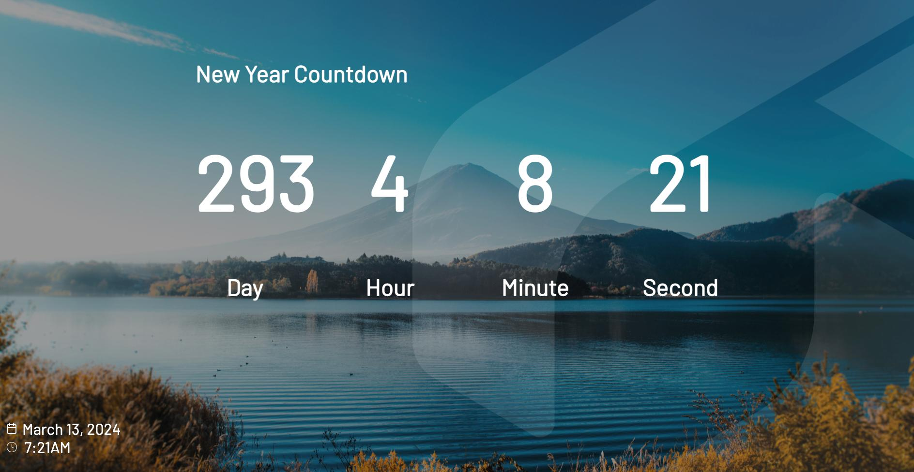

# Screenly Countdown Timer App



## tl;dr

```bash
$ cd edge-apps/countdown-timer
$ screenly edge-app create \
    --name countdown-timer \
    --in-place
$ screenly edge-app deploy
[...] # You can tweak settings here.
# To install an app, you need to create an instance.
$ screenly edge-app instance create

# Alternatively, you can use --latest in place of --revision.
```

## Tweaking the settings

### `target_timestamp`

To set the countdown timer, we can use the `target_timestamp` settings.

```bash
$ Screenly edge-app setting set target_timestamp=2024-03-14T00:00:00
# A relatively long console output...
Edge app setting successfully set.
```
where `2024-03-14T00:00:00` your countdown timer limit with `YYYY-MM-DDTHH:MM:SS` format.

### `countdown_headline`

To set the countdown timer headline, we can use the `countdown_headline` settings.

```bash
$ Screenly edge-app setting set countdown_headline='New Year Countdown'
# A relatively long console output...
Edge app setting successfully set.
```


### `override_timezone`

For instance, if you want to set the countdown timer as per the current date and time in London,
run the following command after setting the timer:

```bash
$ screenly edge-app setting set override_timezone='Europe/Paris'
# A relatively long console output...
Edge app setting successfully set.

$ screenly edge-app setting set override_locale='fr'
# A relatively long console output...
Edge app setting successfully set.
```

See [this page](https://momentjs.com/) for the list of all possible values for the time zone.
Alternatively, you can call `moment.locales()`, which returns all the supported locale values.

Setting invalid values for the timezone won't crash the app itself, it'll just fall back to the default time.
