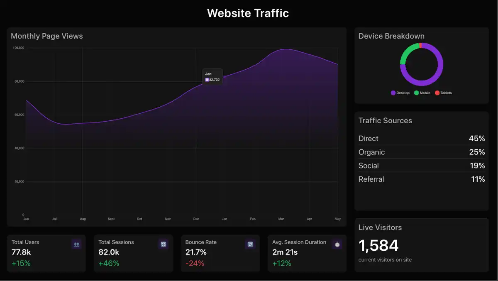

# Fake Dashboard App



A collection of simulated digital signage dashboards. Choose from four distinct views — website analytics, workplace safety, manufacturing operations, or production quality — each with realistic, auto-refreshing data.

## Dashboard Views

| Value | Description |
|---|---|
| `website-traffic` | Live visitor count, traffic sources, device breakdown, and 12-month page-view trend |
| `health-safety` | Days without incident, open hazards, PPE compliance, zone safety status, and safety notices |
| `manufacturing-kpi` | Production output vs target, machine utilization, downtime breakdown, shopfloor status, and alerts |
| `production-qa` | First pass yield, defect/scrap/rework rates, inspection throughput, batch pass/fail, and cost of poor quality |

## Key Highlights

- Four switchable dashboard views via a single Edge App setting
- Real-time simulated metrics that auto-refresh every 30 seconds
- Interactive charts powered by Chart.js
- Fully responsive design from 480px to 4K screens
- Built with vanilla JS — no frameworks or build steps
- No setup required — just install, pick a view, and display

## Configuration

The active dashboard is controlled by the **Dashboard View** setting (`dashboard`) in the Edge App instance. Set it to one of the values from the table above. The default is `website-traffic`.

## Installation

```bash
$ cd edge-apps/fake-dashboard
$ screenly edge-app create \
    --name fake-dashboard \
    --in-place
$ screenly edge-app deploy
[...] # You can tweak settings here.
# To install an app, you need to create an instance.
$ screenly edge-app instance create

# Alternatively, you can use --latest in place of --revision.
```

For more details, please check the [Fake Dashboard Edge App Page](https://www.screenly.io/edge-apps/fake-dashboard/).
