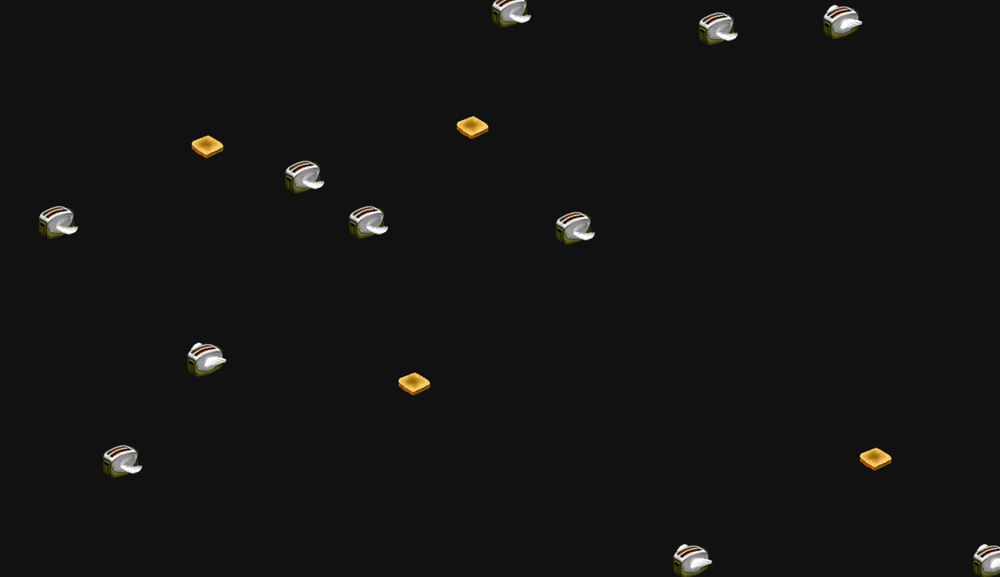

# Flying Toasters



Immerse yourself in a delightful slice of digital nostalgia with the Flying Toasters Screen Saver, now reimagined for the Screenly Edge platform.
This app brings the iconic Flying Toasters screensaver, a cherished relic from the After Dark software series of the late '80s, into the modern era, allowing you to adorn your displays with whimsical toasters and slices of toast in flight, just as they did on the screens of vintage Macintosh computers.

Crafted with meticulous attention to detail, this CSS-based rendition captures the essence and charm of the original screensaver, ensuring a smooth, visually appealing experience that's both a tribute to the past and a delightful addition to your digital environment.
Perfect for adding a touch of retro flair to your screens, the Flying Toasters Screen Saver is not just a screensaver but a conversation piece, evoking nostalgia and sparking joy in viewers of all ages.

## Usage

Either install from the Screen Edge App Store, or install it using the CLI:

```bash
$ screenly edge-app create \
    --in-place \
    --name="Flying Toasters"
$ screenly edge-app upload
$ screenly edge-app version \
    promote --latest
```

## Credits

The original CSS/HTML was written by [Bryan Braun](https://github.com/bryanbraun/after-dark-css). This package merely re-packaged this as an Edge App (with permission from Bryan).
