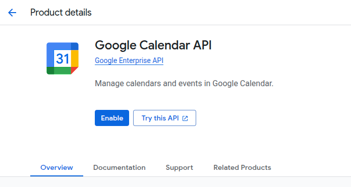
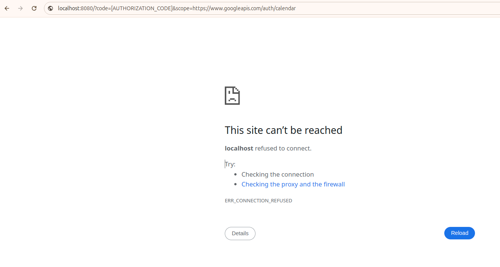

# Screenly Google Calendar App

## Prerequisites

- Node.js (v22.0.0+)
- npm (v10.9.0+)
- Screenly Edge App CLI (v1.0.3+)

## Getting Started

We need to initialize the necessary Node.js dependencies and build the source
code first so that a `dist` directory can be created. This is essential as a manifest file
(which defaults to `screenly.yml`) and an `index.html` file is needed.

```bash
npm install
npm run build
screenly edge-app create \
    --name=EDGE_APP_NAME \
    --in-place \
    --path=dist
```

Since the `dist` directory is ignored by Git, we need to sync `./dist/screenly.yml` with
`./screenly.yml`.

```bash
cp ./dist/screenly.yml ./screenly.yml
```

## Create an Edge App Instance via CLI

```bash
screenly edge-app instance create --path=dist
```

An `instance.yml` file will be created inside the `dist` directory. Sync `./dist/instance.yml`
with your current project directory:

```bash
cp ./dist/instance.yml .
```

## Deployment

Run the following on a terminal to build the Edge App:

```bash
screenly edge-app deploy --path dist/
```

**Option 1: Getting Calendar Events via API**

See [the section on Obtaining an OAuth Client ID, Client Secret, and Refresh Token](#obtaining-an-oauth-client-id-client-secret-and-refresh-token) for instructions on how to get the refresh token, client ID, and client secret.

```bash
screenly edge-app setting set calendar_source_type=api
screenly edge-app setting set refresh_token=<GOOGLE_OAUTH_REFRESH_TOKEN>
screenly edge-app setting set client_id=<GOOGLE_OAUTH_CLIENT_ID>
screenly edge-app setting set client_secret=<GOOGLE_OAUTH_CLIENT_SECRET>
```

**Option 2: Getting Calendar Events via iCal**

See [the section on Getting the iCal URL](#getting-the-ical-url) for instructions on how to get the iCal URL.

```bash
screenly edge-app setting set bypass_cors=true
screenly edge-app setting set calendar_source_type=ical
screenly edge-app settings set ical_url=<YOUR_ICAL_URL>
```

## Development

Run the following on a terminal to start the development server:

```bash
npm install
npm run dev
```

Run the following on a second terminal to generate mock data:

```bash
screenly edge-app run --generate-mock-data --path dist/
```

**Option 1: Getting Calendar Events via API**

Update `dist/mock-data.yml` and update the values of `refresh_token`, `client_id`, and `client_secret` with the values you obtained in the [Obtaining an OAuth Client ID, Client Secret, and Refresh Token](#obtaining-an-oauth-client-id-client-secret-and-refresh-token) section.

Update `dist/mock-data.yml` and update the values of `calendar_source_type` with `api`.

**Option 2: Getting Calendar Events via iCal**

See [the section on Getting the iCal URL](#getting-the-ical-url) for instructions on how to get the iCal URL.

Update `dist/mock-data.yml` and update the values of `ical_url` and `bypass_cors` with the URL of the iCal feed you want to use and `true` respectively.

Update `dist/mock-data.yml` and update the values of `calendar_source_type` with `ical`.

### Running the Development Server

```bash
screenly edge-app run --path dist/
```

## Linting

We use [standard](https://standardjs.com/) to lint the codebase.

```bash
npx standard --fix # Automatically fixes linting errors.
```

Some rules are not automatically fixable, so you will need to fix them manually.

## Obtaining an OAuth Client ID, Client Secret, and Refresh Token

This section will be split into multiple parts:

- Enabling the Google Calendar API
- Configuring OAuth Consent
- Creating an OAuth client ID
- Initiating an OAuth flow
- Obtaining a refresh token

The first half requires browser interaction. The second half can be done only using the command-line.

### What You Need

- A Google Cloud Platform project
- A Google Calendar account

### Part 1: Enabling the Google Calendar API

- Go to the [Google Cloud Console](https://console.cloud.google.com/).
- Click in the **API & Services** sidebar item or in the **Quick access** section.
- Search and click on **Google Calendar API**.
- Click **Enable** to enable the Google Calendar API.



### Part 2: Configuring OAuth Consent

Follow the steps in the [this guide on configuring OAuth consent](https://developers.google.com/workspace/guides/configure-oauth-consent).

- The publishing status will default to **Testing**.
- If you want to change the publishing status, you can do so by clicking **Audience** on the sidebar and then clicking **Publish app**. You will be prompted if you want to confirm the change. Click **Confirm**.

### Part 3: Creating an OAuth client ID

Follow the steps in the [this guide on creating an OAuth client ID](https://developers.google.com/workspace/guides/create-credentials#oauth-client-id).

- Make sure to add at least one URL to the **Authorized redirect URIs** list by clicking on the **+ Add URI** button.
- As of the time of writing, URIs must be in HTTP or HTTPS format.

Once done, go to [the credentials page](https://console.cloud.google.com/apis/credentials) and find the client ID you just created. Click the download icon. A modal will appear. Click `Download JSON`. It will download a file with the name `client_secret_*.json`. The JSON file contains the following information that you will need in the next steps:

- `client_id`
- `client_secret`
- `auth_uri` &mdash; <https://accounts.google.com/o/oauth2/auth>
- `token_uri` &mdash; <https://oauth2.googleapis.com/token>

### Part 4: Initializing an OAuth flow

In this section, you will be initializing an OAuth flow by entering the following URL in your browser:

```plaintext
https://accounts.google.com/o/oauth2/v2/auth?client_id=YOUR_CLIENT_ID
&response_type=code
&scope=https://www.googleapis.com/auth/calendar
&access_type=offline
&prompt=consent
&redirect_uri=YOUR_REDIRECT_URI
```

You will be prompted to select a Google account. Select the account you want to use to access your Google Calendar. Follow the instructions to allow access to your Google Calendar.

Once redirected to your `redirect_uri`, check the address bar for the `code` parameter. In the screenshot below, the `code` parameter is `[AUTHORIZATION_CODE]`. Take note that the real authorization code is redacted for privacy reasons.



For instance, if you set the redirect URI to a localhost URL, it's expected that you will get something like a "This site can't be reached" error.
That is expected behavior. As long as we obtain the authorization code, we can proceed to the next step.

### Part 5: Obtaining a refresh token

In this section, you will be obtaining a refresh token by making a request to the OAuth token endpoint.

Run the following command in your terminal:

```bash
curl -sX POST 'https://oauth2.googleapis.com/token' \
  -H 'Content-Type: application/x-www-form-urlencoded' \
  -d 'code=AUTHORIZATION_CODE' \
  -d 'client_id=YOUR_CLIENT_ID' \
  -d 'client_secret=YOUR_CLIENT_SECRET' \
  -d 'redirect_uri=YOUR_REDIRECT_URI' \
  -d 'grant_type=authorization_code' | jq
```

The response will include a `refresh_token` and an `access_token` that can last up to 1 hour.

```json
{
  "access_token": "ya29.a0AZY....[REDACTED]....175",
  "expires_in": 3599,
  "refresh_token": "1//06o8d....[REDACTED]....nlo",
  "scope": "https://www.googleapis.com/auth/calendar",
  "token_type": "Bearer",
}
```

> [!NOTE]
> If a Google Cloud Platform project's OAuth consent screen is configured for external users and the publishing status is set to **Testing**, the `refresh_token` will only be valid 7 days. As such, you will receive a response with a `refresh_token_expires_in` of approximately 7 days (604799 seconds).
>
> ```json
> {
>   "access_token": "ya29.a0AZY....[REDACTED]....175",
>   "expires_in": 3599,
>   "refresh_token": "1//06o8d....[REDACTED]....nlo",
>   "scope": "https://www.googleapis.com/auth/calendar",
>   "token_type": "Bearer",
>   "refresh_token_expires_in": 604799
> }
> ```

You now have a refresh token that you can use in your Edge App. Save it somewhere safe so that you would not lose it.

> [!NOTE]
> Running the command above the second time will give the following error:
>
> ```plaintext
> {
>   "error": "invalid_grant",
>   "error_description": "Bad Request"
> }
> ```

### Getting the iCal URL

- Go to your [Google Calendar](https://google.com/calendar).
- On the left sidebar, under "My calendars", select the calendar you want
  to use.
- Click on the three dots on the right side of the calendar and select
  "Settings and sharing".
- Scroll down until you see "Secret address in iCal format".
  Click on the copy button to the right.
- A "Security warning" will appear, saying that
  "[you] should not give the secret address to other people".
  Click "OK" to continue.
- The secret address will be copied to your clipboard, which you can use
  into the Edge App settings.
