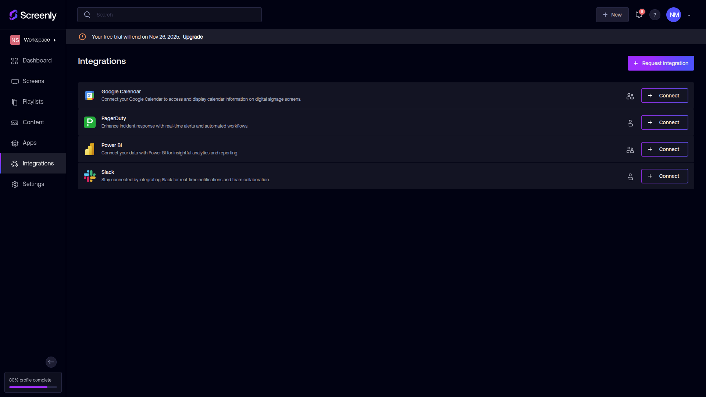

Outlook Calendar App

## Prerequisites

- Bun (v1.2.2+)
- Screenly Edge App CLI (v1.0.3+)

## Getting Started

We need to initialize the necessary dependencies and build the source
code first so that a `dist` directory can be created. This is essential as a manifest file
(which defaults to `screenly.yml`) and an `index.html` file is needed.

```bash
bun install
bun run build
screenly edge-app create \
    --name=EDGE_APP_NAME \
    --in-place
```

## Connect Screenly to a Microsoft Account

You should connect Screenly to a Microsoft account so that the app can access the calendar events via an Outlook Calendar access token.

To get started, go to the [Integrations](https://app.screenlyapp.com/manage/integrations) page and click the "+ Connect" button next to "Outlook Calendar".



You will be prompted to confirm the connection to a Microsoft account. Click the "Connect" button.


You will be redirected to a Microsoft OAuth consent screen. Select the Microsoft account you want to connect to Screenly. Follow through the prompts to grant Screenly access to your Outlook Calendar data.

Once connected, you will be redirected back to the integrations page. You should see that the Outlook Calendar integration is now connected.

## Create an Edge App Instance via CLI

```bash
screenly edge-app instance create --name=EDGE_APP_INSTANCE_NAME
```

## Deployment

```bash
bun run deploy
```

## Development

Install the dependencies for the first run:

```bash
bun install
```

Run the following command to start the development server:

```bash
bun run dev
```

This will start the development server via the [Screenly CLI](https://github.com/Screenly/cli) and open the app in the browser.

Update `mock-data.yml` with the following values:

- `screenly_app_auth_token`: A Microsoft OAuth access token with sufficient scopes to read calendar events
  - Check [this documentation about using OAuth 2.0 web server applications](https://learn.microsoft.com/en-us/entra/identity-platform/v2-oauth2-auth-code-flow) for more information on how to get an access token.
- `screenly_oauth_tokens_url`: `https://api.screenlyappstage.com/api/v3/edge-apps/oauth/tokens/`

## Linting and Formatting

```bash
bun run lint
bun run format
```
