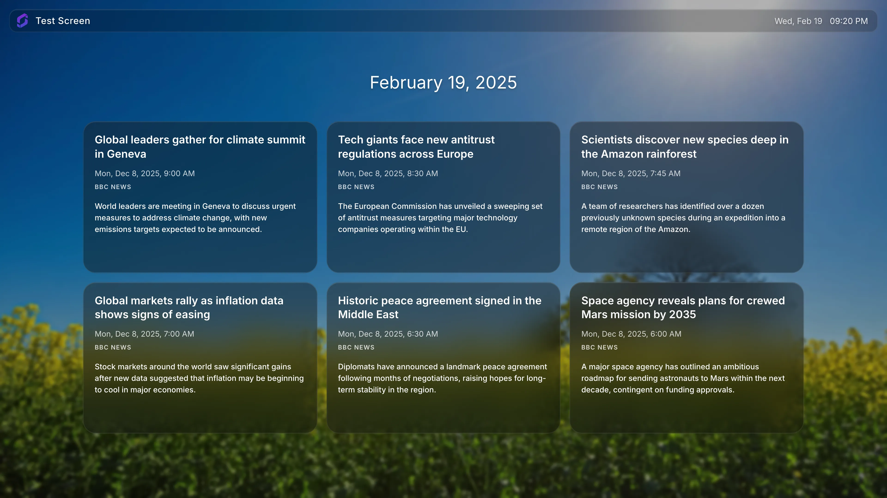

# RSS Reader

Displays the latest entries from any RSS feed on your Screenly digital signage screens.



## Getting Started

```bash
bun install
```

## Development

```bash
bun run dev
```

## Testing

```bash
bun test
```

## Build

```bash
bun run build
```

## Deployment

```bash
screenly edge-app create --name rss-reader --in-place
bun run deploy
screenly edge-app instance create
```

## Configuration

| Setting             | Description                                                          | Type     | Default                                |
| ------------------- | -------------------------------------------------------------------- | -------- | -------------------------------------- |
| `bypass_cors`       | Route the RSS feed URL through the CORS proxy                        | optional | `true`                                 |
| `cache_interval`    | How often (in seconds) to refresh the feed                           | required | `1800`                                 |
| `display_errors`    | Show errors on screen for debugging purposes                         | optional | `false`                                |
| `override_locale`   | Override the locale used for date formatting (e.g. `en`, `fr`, `de`) | optional | `en`                                   |
| `override_timezone` | Override the timezone for date display (e.g. `Europe/London`)        | optional | system timezone                        |
| `rss_title`         | Source label displayed on each card                                  | required | `BBC News`                             |
| `rss_url`           | URL of the RSS feed to display                                       | required | `http://feeds.bbci.co.uk/news/rss.xml` |

## Example Feeds

The following feeds have been tested and are known to work. Some sources require the CORS proxy, so set `bypass_cors` accordingly.

| Source              | URL                                                         | `bypass_cors` |
| ------------------- | ----------------------------------------------------------- | ------------- |
| ABC News            | `https://abcnews.go.com/abcnews/topstories`                 | `true`        |
| Al Jazeera          | `https://www.aljazeera.com/xml/rss/all.xml`                 | `true`        |
| BBC News            | `http://feeds.bbci.co.uk/news/rss.xml`                      | `true`        |
| CNN                 | `http://rss.cnn.com/rss/cnn_topstories.rss`                 | `true`        |
| Fox News            | `https://moxie.foxnews.com/google-publisher/latest.xml`     | `true`        |
| NPR News            | `https://feeds.npr.org/1004/rss.xml`                        | `true`        |
| New York Times      | `https://rss.nytimes.com/services/xml/rss/nyt/World.xml`    | `false`       |
| Wall Street Journal | `https://feeds.content.dowjones.io/public/rss/RSSWorldNews` | `true`        |

## Screenshots

```bash
bun run screenshots
```
