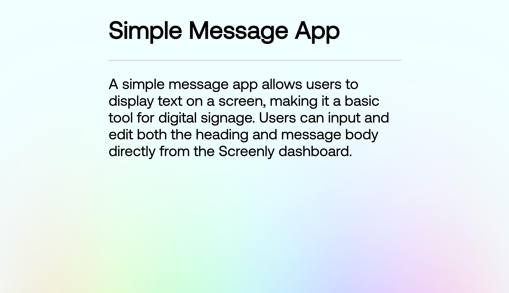

# Screenly Simple Message App

A simple message app allows users to display text on a screen, making it a basic tool for digital signage. Users can input and edit both the heading and message body directly from the Screenly dashboard.



## tl;dr

```bash
$ cd edge-apps/countdown-timer
$ screenly edge-app create \
    --name simple-message-app \
    --in-place
$ screenly edge-app deploy
# To install an app, you need to create an instance.
$ screenly edge-app instance create

```

## Tweaking the settings

### `message_head`

To configure the heading of the message app, utilize the `message_head` settings.

```bash
$ screenly edge-app setting set message_head='This is message head'
# A relatively long console output...
Edge app setting successfully set.
```
The message app's heading should be defined as a string in the format: "This is message head".

### `message_body`

To define the content of the message app's body, utilize the `message_body` settings.

```bash
$ screenly edge-app setting set message_body='This is message body'
# A relatively long console output...
Edge app setting successfully set.
```
