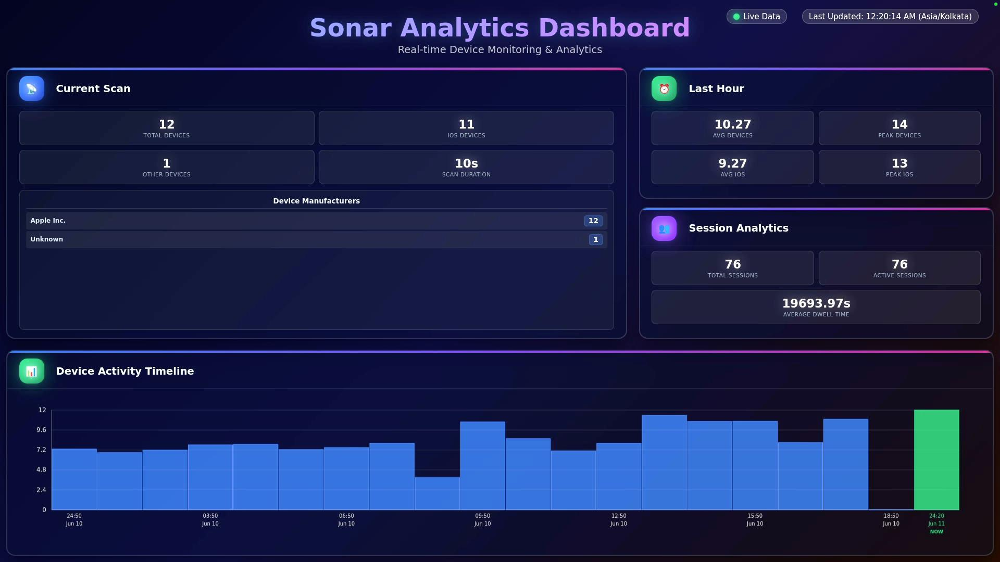

# Sonar Dashboard - Edge App



A real-time dashboard Edge App that displays analytics from the [Sonar BLE Device Counter](https://github.com/Viktopia/sonar) - providing "*Analytics for the real world*" through Bluetooth Low Energy device tracking.

## 🎯 Overview

This Edge App creates a beautiful, real-time dashboard that visualizes data from a Sonar BLE Device Counter instance. It shows foot traffic analytics, device manufacturer statistics, and historical trends perfect for retail analytics, event monitoring, or general people counting applications.

## 📋 Requirements

- **Sonar BLE Device Counter** ([GitHub](https://github.com/Viktopia/sonar)) Installed on a Raspberry Pi or Linux device
- **Screenly Player** with network access to Sonar instance

## ✨ Features

- **Real-time Device Counting** - Live display of unique BLE devices in proximity
- **iOS Device Detection** - Separate tracking and analytics for iOS devices
- **Manufacturer Analytics** - Breakdown of device manufacturers (Apple, Samsung, etc.)
- **Historical Data Visualization** - 24-hour timeline with interactive charts
- **Session Analytics** - Track dwell time and active sessions
- **Auto-refresh** - Updates every 30 seconds automatically
- **Timezone Support** - Automatic timezone detection based on screen location

## 🏗️ Architecture

```bash
┌─────────────────┐    HTTP/CORS     ┌──────────────────┐
│   Screenly      │ ←─────────────── │  Sonar BLE       │
│   Dashboard     │      API         │  Device Counter  │
│   (Edge App)    │                  │  (Raspberry Pi)  │
└─────────────────┘                  └──────────────────┘

```

The dashboard connects to your Sonar instance via HTTP API calls, displaying:
- Current scan results (`/api/latest`)
- Time-series data (`/api/time-series`)
- Historical analytics and trends

## 🛠️ Setup Instructions

### Prerequisites

1. **Sonar BLE Device Counter** running on a Raspberry Pi or Linux device
   - Follow the [Sonar setup guide](https://github.com/Viktoria/sonar)
   - Ensure the API is accessible on your network
   - Note the IP address and port (usually `http://your-pi-ip:8000`)

2. **Network Access** between your Screenly device and Sonar instance

### Configuration

Configure the following settings in your Screenly dashboard:

| Setting | Description | Example |
|---------|-------------|---------|
| `api_host` | IP address of your Sonar instance | `192.168.1.100` |
| `api_port` | Port number (usually 8000) | `8000` |

### Screenly Settings Configuration

1. In your Screenly dashboard, navigate to the Edge App settings
2. Set the following parameters:

   ```bash
   api_host: 192.168.1.100    # Your Raspberry Pi IP
   api_port: 8000             # Sonar API port
   ```

## 📊 Dashboard Sections

### Current Scan (Left Panel)
- **Total Devices**: Current unique BLE devices detected
- **iOS Devices**: Apple devices in proximity
- **Other Devices**: Non-Apple BLE devices
- **Scan Duration**: Time taken for the current scan
- **Manufacturer Breakdown**: Top device manufacturers detected

### Last Hour Analytics (Top Right)
- **Average Devices**: Mean device count over the last hour
- **Peak Devices**: Maximum devices detected in the last hour
- **iOS vs Other**: Breakdown of device types

### Session Analytics (Bottom Right)
- **Total Sessions**: Number of device sessions tracked
- **Active Sessions**: Currently active device sessions
- **Average Dwell Time**: Mean time devices stay in range

### 24-Hour Timeline (Bottom)
- Interactive histogram showing device activity over 24 hours
- Real-time updates with current data highlighted
- Timezone-aware timestamps

## 🔧 Sonar API Endpoints

The dashboard consumes these endpoints from your Sonar instance:

### `/api/latest`
Returns current scan results and recent statistics:
```json
{
  "current_scan": {
    "unique_devices": 8,
    "ios_devices": 5,
    "other_devices": 3,
    "manufacturer_stats": {
      "Apple Inc.": 5,
      "Nordic Semiconductor ASA": 3
    },
    "scan_duration_seconds": 10
  },
  "last_hour": {
    "average_unique_devices": 7.5,
    "peak_unique_devices": 9,
    "manufacturer_stats": {...}
  }
}
```

### `/api/time-series`
Provides historical data for the timeline chart:
```json
{
  "time_series": [
    {
      "timestamp": "2024-03-20T10:00:00",
      "average_unique_devices": 8.0,
      "peak_unique_devices": 9,
      "manufacturer_stats": {...}
    }
  ]
}
```

## 🚀 Use Cases

- **Retail Analytics**: Track foot traffic in stores and shopping centers
- **Event Monitoring**: Monitor attendance at conferences, exhibitions, or festivals
- **Space Utilization**: Analyze usage patterns in offices, libraries, or public spaces
- **Marketing Insights**: Understand customer dwell time and visit patterns
- **Security**: Monitor occupancy levels for safety compliance


