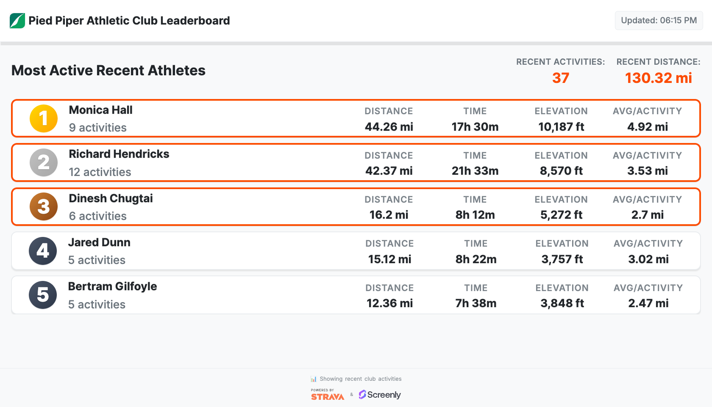

# Strava Club Leaderboard Edge App

A beautiful, real-time leaderboard for Strava clubs that displays member rankings based on activity data. Perfect for motivating team members and displaying club achievements on Screenly Players.



## Features

- **Real-time leaderboard**: Displays club members ranked by total distance
- **Comprehensive statistics**: Shows distance, time, elevation, and activity count
- **Modern design**: Clean, responsive interface with smooth animations
- **Auto-refresh**: Updates every 5 minutes automatically
- **Automatic token refresh**: Seamlessly renews expired Strava tokens without interruption
- **Caching**: Efficient data caching to reduce API calls
- **Error handling**: Graceful error states with helpful messages
- **Responsive**: Adapts to different screen sizes and resolutions
- **Unit Type Configuration**: Users can choose whether to display units in Imperial or Metric.

## Prerequisites

- Screenly CLI installed ([installation guide](https://github.com/Screenly/cli))
- Strava API access (free Strava account required)
- Access to a Strava club (as member or admin)

## Strava API Setup

### 1. Create a Strava App

1. Go to [Strava API Settings](https://www.strava.com/settings/api)
2. Click "Create App" if you don't have one
3. Fill in the application details:
   - **Application Name**: Your app name (e.g., "Club Leaderboard")
   - **Category**: Choose "Visualizer"
   - **Club**: Select your club
   - **Website**: Your Site or Screenly Playground URL
   - **Authorization Callback Domain**: `localhost` (for testing)

### 2. Get Your API Credentials

After creating the app, you'll see:

- **Client ID**: A numeric ID (e.g., 168413)
- **Client Secret**: A secret string (keep this private)
- **Access Token**: Your personal access token
- **Refresh Token**: For long-term access (**required for automatic token renewal**)
- **Expires At**: Unix timestamp when the access token expires

### 4. Find Your Club ID

1. Go to your Strava club page
2. The URL will look like: `https://www.strava.com/clubs/YOUR_CLUB_ID`
3. Copy the club ID from the URL

## Installation

### 1. Clone the Repository

```bash
git clone https://github.com/Screenly/Playground.git
cd Playground/edge-apps/strava-club-leaderboard
```

### 2. Login to Screenly

```bash
screenly login
```

### 3. Create the Edge App

```bash
screenly edge-app create \
    --name "Strava Club Leaderboard" \
    --in-place
```

### 4. Deploy the App

```bash
screenly edge-app deploy
```

### 5. Create an Instance

```bash
screenly edge-app instance create
```

## Configuration

### Required Settings

Set your Strava API credentials:

```bash
# Set your Strava Client ID
screenly edge-app setting set client_id=YOUR_CLIENT_ID

# Set your Strava Client Secret (secure)
screenly edge-app secret set client_secret=YOUR_CLIENT_SECRET

# Set your Strava Access Token (secure)
screenly edge-app secret set access_token=YOUR_ACCESS_TOKEN

# Set your Strava Refresh Token (secure) - for automatic token renewal
screenly edge-app secret set refresh_token=YOUR_REFRESH_TOKEN

# Set your Strava Client Secret (secure) - required for token refresh
screenly edge-app secret set client_secret=YOUR_CLIENT_SECRET

# Set your Club ID
screenly edge-app setting set club_id=YOUR_CLUB_ID
```

## Usage

### Viewing the Leaderboard

1. Open your Screenly dashboard
2. Navigate to Assets
3. Find your "Strava Club Leaderboard" app
4. Add it to a playlist
5. Assign the playlist to your device

### Leaderboard Features

- **Rankings**: Athletes ranked by total distance in the selected time period
- **Statistics**: Each athlete shows:
  - Total distance covered
  - Total elevation gained
  - Average distance per athlete
  - Total time spent
  - **Auto-refresh**: Updates every 5 minutes
  - **Time Period**: Shows "This Week" or "This Month" based on settings

### Supported Screen Resolutions

The app is optimized for all Screenly-supported resolutions:

- 4K displays (3840x2160)
- Full HD (1920x1080)
- HD (1280x720)
- Standard (1024x768)
- Portrait orientations
- Raspberry Pi screens (800x480 and below)

## Automatic Token Management

The app includes robust token management to ensure uninterrupted operation:

- **Pure JavaScript management**: Token expiry is managed entirely in memory with no external dependencies
- **Proactive refresh**: Tokens are refreshed 5 minutes before expiry (when expiry is known)
- **Reactive handling**: If expiry time is unknown, handles token refresh automatically on 401 errors
- **Automatic retry**: If a request fails due to token expiry, the app automatically refreshes and retries
- **Zero configuration**: No need to set or manage expiry timestamps manually
- **Error recovery**: Clear error messages guide users to resolve authentication issues
- **No manual intervention**: Once configured, the app maintains itself without user interaction

This is particularly important for digital signage where the display may run unattended for weeks or months.

## Support

For issues or questions:

- Check the [Screenly documentation](https://developer.screenly.io/edge-apps)
- Visit the [Strava API documentation](https://developers.strava.com/docs)
- Contact Screenly support
- Open an issue in the repository

---

**Note**: This app requires a Strava account and API access. Ensure you comply with Strava's API terms of service and rate limits.
