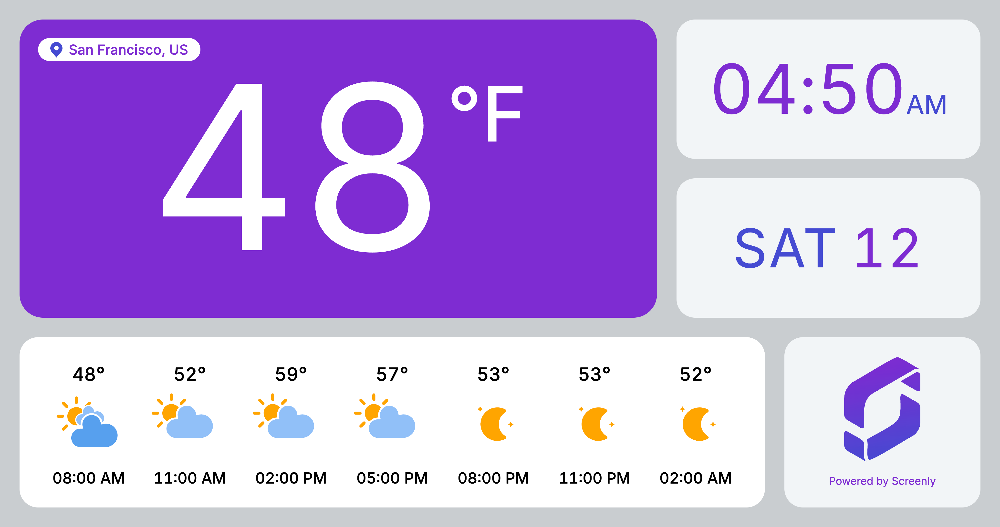

# Screenly Weather App



To use this Edge App, you need a [OpenWeather](https://openweathermap.org) API key.

## Creating an Edge App and uploading

```bash
$ cd edge-apps/weather
$ screenly edge-app create \
    --name=EDGE_APP_NAME \
    --in-place
$ screenly edge-app deploy
$ screenly edge-app instance create
$ screenly edge-app setting set openweathermap_api_key=MY_API_KEY
```
