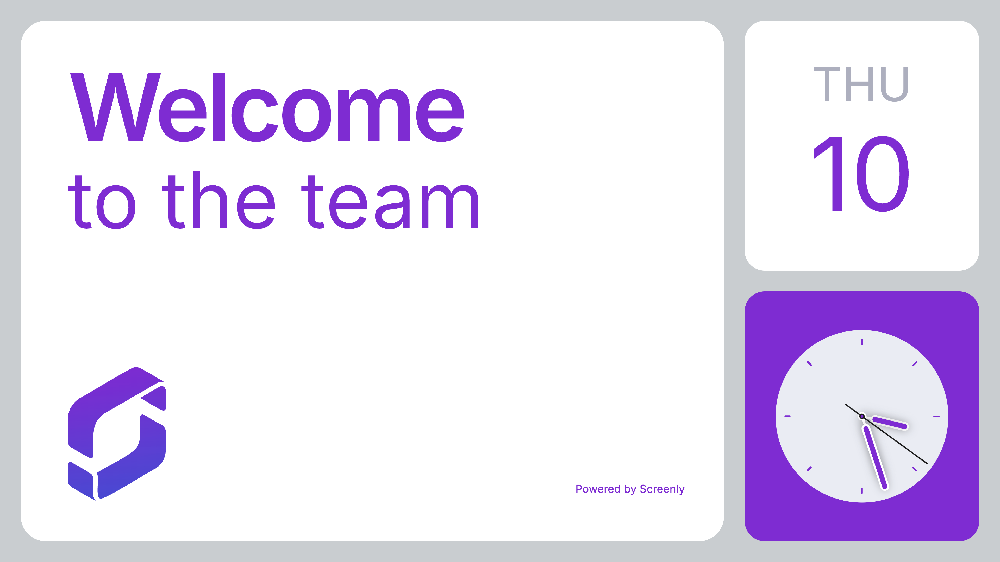

# # Screenly Welcome App

A customizable welcome screen app that lets users display a personalized greeting or message on their digital signage. Easily configure the heading and body text via the Screenly dashboard, making it ideal for receptions, events, or branded displays.



## Tweaking the settings

### `welcome_heading`

To configure the heading of the message app, utilize the `welcome_heading` settings.

```bash
$ screenly edge-app setting set welcome_heading='Welcome'
# A relatively long console output...
Edge app setting successfully set.
```

The welcome app's heading should be defined as a string in the format: "This is message head".

### `welcome_message`

To configure the heading of the message app, utilize the `welcome_message` settings.

```bash
$ screenly edge-app setting set welcome_message='to the team'
# A relatively long console output...
Edge app setting successfully set.
```

The welcome app's message should be defined as a string in the format: "This is message body".

### `theme` (optional)

Specifies the application's theme color and logo style. Available options are 'light' or 'dark'.

This setting determines the overall theme appearance and adjusts the logo accordingly and you can change your default value in the Screenly settings page.

```bash
$ screenly edge-app setting set theme='light'
# A relatively long console output...
Edge app setting successfully set.
```

### `override_timezone` (optional)

For instance, if you want to clock app to display the current date and time in London,
run the following command:

```bash
$ screenly edge-app setting set override_timezone='Europe/Paris'
# A relatively long console output...
Edge app setting successfully set.

$ screenly edge-app setting set override_locale='fr'
# A relatively long console output...
Edge app setting successfully set.
```

See [this page](https://momentjs.com/) for the list of all possible values for the time zone.
Alternatively, you can call `moment.locales()`, which returns all the supported locale values.

Setting invalid values for the timezone won't crash the app itself, it'll just fall back to the default time.


## Development Prerequisites

- [Bun (1.2.2+)](https://bun.sh/docs/installation)
- [Screenly Edge App CLI (v1.0.3+)](https://github.com/Screenly/cli?tab=readme-ov-file#installation)

## Getting Started

```bash
bun install
screenly edge-app create \
    --name=EDGE_APP_NAME \
    --in-place
```

## Create an Edge App Instance via CLI

```bash
screenly edge-app instance create --name=EDGE_APP_INSTANCE_NAME
```

## Deployment

```bash
bun run deploy
```

> [!NOTE]
> The `deploy` command takes care of building the app as well.

## Development

Install the dependencies for the first run:

```bash
bun install
```

Run the following on a terminal to start the build process in watch mode:

```bash
bun run build:dev
```

Open another terminal and run the following:

```bash
bun run dev
```

This will start the development server via the [Screenly CLI](https://github.com/Screenly/cli).

```plaintext
$ screenly edge-app run --path=dist/
Edge App emulator is running at http://127.0.0.1:38085/edge/1/index.html
```

Copy the URL and paste it in the browser to see the app in action.

## Unit Tests

To run unit tests:

```bash
bun run test:unit
```

Press `q` to quit the test runner.

## E2E Tests

Install dependencies for the first run:

```bash
bun run playwright install-deps
bun run playwright install
```

To run E2E tests:

```bash
bun run test:e2e
```

### Linting and Formatting

```bash
bun run lint
bun run format
```
