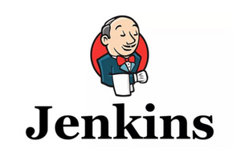
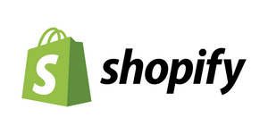

# Site Automation (aka JavaScript Injector)

Screenly's JavaScript Injector feature allows users to perform automation on websites, such as:

* Logging into sites using credentials (or a cookie)
* Close modals, such as GDPR consent dialogues
* Scroll down a page

## Usage

To use the JavaScript Injector, you need first to create the web asset.

You can do that in the [user interface](https://login.screenlyapp.com), our [CLI](https://github.com/Screenly/cli/) or by using our [API](https://developer.screenlyapp.com/#operation/assets_create) directly. The recommended way to work with our JavaScript Injector is to use the CLI, so we will be using that for the documentation.

```bash
$ screenly asset add https://www.engadget.com Engadget
+----------------------------+-------------+------+--------+
| Id                        | Title     | Type | Status |
+----------------------------+-------------+------+--------+
| XXXXXXXXXXXXXXXXXXXXXXXXXX | Engadget | N/A  | none   |
+----------------------------+-------------+------+--------+
```

Let's store the Asset ID for later
```bash
$ export ASSSET_ID=XXXXXXXXXXXXXXXXXXXXXXXXXX
XXXXXXXXXXXXXXXXXXXXXXXXXX
```

Alternatively, we can use the nifity `--json` option in the CLI and pipe it to `jq` to just get the Asset ID:

```bash
$ screenly asset list --json | jq -r '.[] | select (.title|test("Engadget")) | .id'
XXXXXXXXXXXXXXXXXXXXXXXXXX
```

With our asset created, we can now apply the JavaScript Injection for this site. The above site, Engadget, uses Yahoo's cookie consent popover. When you first navigate to the site, you need to click the cookie consent dialogue to continue. This is obviously not ideal for digital signage.

Luckily, we can use JavaScript to close this dialogue. The script [`yahoo-cookies-consent-closing.js`](https://raw.githubusercontent.com/Screenly/playground/master/javascript-injectors/examples/yahoo-cookies-consent-closing.js) does just that, so let's apply it to our asset using the CLI:

```bash
$ export JAVASCRIPT_URL='https://raw.githubusercontent.com/Screenly/playground/master/javascript-injectors/examples/yahoo-cookies-consent-closing.js'
$ screenly asset inject-js "$ASSET_ID" "$JAVASCRIPT_URL"
20XX-XX-XXTXX:XX:XX.XXXZ INFO  [screenly] Asset updated successfully.
```

That's it! When the asset now loads on your screen, the above snippet will run automatically and close the cookie consent dialogue.

### Important considerations

* Your script should be idempotent as it can run multiple times.
* Your script should execute with an interval or await when a specific element appears on the page. There is no guarantee that the page is fully loaded when the injector runs the script.
* Screenly player persists cookies set for a slide until the player reboots or playlist changes. You can check if you have already set a cookie to optimize your script.
* If your page includes redirects, the player will execute the injection script on each page.

## Examples

### Hello World

**tl;dr**: Use JavaScript to change the text 'Hello World' to 'Hello John' on the demo page available on [playground.srly.io/hello-world](https://playground.srly.io/hello-world).

#### Add a web asset

First we need to add the web asset that we want to use for our JavaScript test. This can be done easily using the CLI:

```bash
$ screenly asset add https://playground.srly.io/hello-world 'Hello World'
+----------------------------+-------------+------+--------+
| Id                         | Title       | Type | Status |
+----------------------------+-------------+------+--------+
| XXXXXXXXXXXXXXXXXXXXXXXXXX | Hello World | N/A  | none   |
+----------------------------+-------------+------+--------+

# Let's store the Asset ID for later
$ export ASSSET_ID=XXXXXXXXXXXXXXXXXXXXXXXXXX
```

Next, you need to log into the web interface and schedule the web asset titled 'Hello World' to an active playlist such that it will show on one of your screens.

When the asset comes into rotation on your screen, you will notice that it says 'Hello World' on the screen. In the next step, we will use JavaScript to change this to 'Hello John' on load.

#### Inject JavaScript

The relevant JavaScript is very simple:

```JavaScript
(function () {
  document.querySelector('.replace-me').innerText = 'John'
})()
```

Again, using our CLI, along with the URL to the JavaScript above, we're able instruct Screenly to run the above JavaScript when loading the page.

```bash
$ export JAVASCRIPT_URL='https://raw.githubusercontent.com/Screenly/playground/master/javascript-injectors/examples/hello-world.js'
$ screenly asset inject-js "$ASSET_ID" "$JAVASCRIPT_URL"
20XX-XX-XXTXX:XX:XX.XXXZ INFO  [screenly] Asset updated successfully.
```

That's it!

Upon next load, you will see the text changing from 'Hello World' to 'Hello John'. In reality, this is a rather useless example. What it is is intend to do is to show how you can execute JavaScript onload. For instance, you could use this to lose a GDPR dialogue, or log into a website.

### Sign in to Screenly via cookies


* Sign into the Screenly [user interface](https://login.screenlyapp.com).
* Retrieve the cookie `beaker.session.id` from your browser.
* Download [screenly-signin-via-cookies.js](https://github.com/Screenly/playground/tree/master/javascript-injectors/examples/screenly-signin-via-cookies.js) and modify it with your `beaker.session.id`.
* Run `screenly asset inject-js "$ASSET_ID" /path/to/script.js` to add the JavaScript

### Sign in to Tableau via cookies


* Sign into your Tableau account.
* Extract the cookie `SSESS[...]` from your browser.
* Download [tableau-via-cookies.js](https://github.com/Screenly/playground/tree/master/javascript-injectors/examples/tableau-via-cookies.js) and modify it with your cookies.
* Run `screenly asset inject-js "$ASSET_ID" /path/to/script.js` to add the JavaScript

## Sign in to Power BI via cookies


* Log in to your Power BI account.
* Extract the following cookies from your browser:
  * `.AspNet.CookiesC1`
  * `.AspNet.CookiesC2`
  * `.AspNet.Cookies`
* Download [powerbi-signin-via-cookies.js](https://github.com/Screenly/playground/tree/master/javascript-injectors/examples/powerbi-signin-via-cookies.js), modify it with your cookies.
* Run `screenly asset inject-js "$ASSET_ID" /path/to/script.js` to add the JavaScript

## Sign in to Power BI via credentials


* Download [powerbi-signin-via-credentials.js](https://github.com/Screenly/playground/tree/master/javascript-injectors/examples/powerbi-signin-via-credentials.js) and modify it with your credentials.
* Run `screenly asset inject-js "$ASSET_ID" /path/to/script.js` to add the JavaScript

## Sign in to Ship Hero via credentials


* Download [shiphero-signin-via-credentials.js](https://github.com/Screenly/playground/tree/master/javascript-injectors/examples/shiphero-signin-via-credentials.js) and modify it with your credentials.
* Run `screenly asset inject-js "$ASSET_ID" /path/to/script.js` to add the JavaScript

## Sign in to Magento Dashboard via credentials


* Download [magento-signin-via-credentials.js](https://github.com/Screenly/playground/tree/master/javascript-injectors/examples/magento-signin-via-credentials.js) and modify it with your credentials.
* Run `screenly asset inject-js "$ASSET_ID" /path/to/script.js` to add the JavaScript

## Sign in to Domo Dashboard via credentials


* Download [domo-dashboard-via-credentials.js](https://github.com/Screenly/playground/tree/master/javascript-injectors/examples/domo-dashboard-via-credentials.js) and modify it with your credentials.
* Run `screenly asset inject-js "$ASSET_ID" /path/to/script.js` to add the JavaScript

## Sign in to Domo Dashboard via access code


* Download [domo-dashboard-via-access-code.js](https://github.com/Screenly/playground/tree/master/javascript-injectors/examples/domo-dashboard-via-access-code.js) and modify it with your credentials.
* Run `screenly asset inject-js "$ASSET_ID" /path/to/script.js` to add the JavaScript

## Yahoo cookies consent closing


Applicable to Yahoo sites like Engadget, TechCrunch etc.

```bash
$ export JAVASCRIPT_URL='https://raw.githubusercontent.com/Screenly/playground/master/javascript-injectors/examples/yahoo-cookies-consent-closing.js'
$ screenly asset inject-js "$ASSET_ID" "$JAVASCRIPT_URL"
20XX-XX-XXTXX:XX:XX.XXXZ INFO  [screenly] Asset updated successfully.
```

## Ez-cookie cookies consent closing

```bash
* export JAVASCRIPT_URL='https://github.com/Screenly/playground/tree/master/javascript-injectors/examples/ezcookie-cookies-consent-closing.js'
$ screenly asset inject-js "$ASSET_ID" "$JAVASCRIPT_URL"
```

## Sign in to Unifi Captive portal

```bash
* export JAVASCRIPT_URL='https://github.com/Screenly/playground/tree/master/javascript-injectors/examples/unifi-signin-via-credentials.js'
$ screenly asset inject-js "$ASSET_ID" "$JAVASCRIPT_URL"
```

## Sign in to Jenkins via credentials



* Download [jenkins-sign-in-via-credentials.js](https://github.com/Screenly/Playground/tree/master/javascript-injectors/examples/jenkins-sign-in-via-credentials.js) and modify it with your credentials.
* Run `screenly asset inject-js "$ASSET_ID" /path/to/script.js` to add the JavaScript

## Sign in to Shopify via credentials



* Download [shopify-signin-via-credentials.js](https://github.com/Screenly/Playground/tree/master/javascript-injectors/examples/shopify-signin-via-credentials.js) and modify it with your credentials.
* Run `screenly asset inject-js "$ASSET_ID" /path/to/script.js` to add the JavaScript

## Sign in to Nagios via credentials


* Download [nagios-signin-via-credentials.js](https://github.com/Screenly/Playground/tree/master/javascript-injectors/examples/nagios-signin-via-credentials.js) and modify it with your credentials.
* Run `screenly asset inject-js "$ASSET_ID" /path/to/script.js` to add the JavaScript

## Sign in to Cyfe via credentials


* Download [cyfe-sign-in-via-credentials.js](https://github.com/Screenly/Playground/tree/master/javascript-injectors/examples/cyfe-sign-in-via-credentials.js) and modify it with your credentials.
* Run `screenly asset inject-js "$ASSET_ID" /path/to/script.js` to add the JavaScript

## Sign in to Zabbix via credentials


* Download [zabbix-login-via-credentials.js](https://github.com/Screenly/Playground/tree/master/javascript-injectors/examples/zabbix-login-via-credentials.js) and modify it with your credentials.
* Run `screenly asset inject-js "$ASSET_ID" /path/to/script.js` to add the JavaScript

## Sign in to Dynatrace via credentials arcgis-logo.svg


* Download [dynatrace-login-via-credentials.js](https://github.com/Screenly/Playground/tree/master/javascript-injectors/examples/dynatrace-login-via-credentials.js) and modify it with your credentials.
* Run `screenly asset inject-js "$ASSET_ID" /path/to/script.js` to add the JavaScript

## Sign in to ArcGIS via credentials


* Download [arcgis-signin-via-credentials.js](https://github.com/Screenly/Playground/tree/master/javascript-injectors/examples/arcgis-signin-via-credentials.js) and modify it with your credentials.
* Run `screenly asset inject-js "$ASSET_ID" /path/to/script.js` to add the JavaScript
